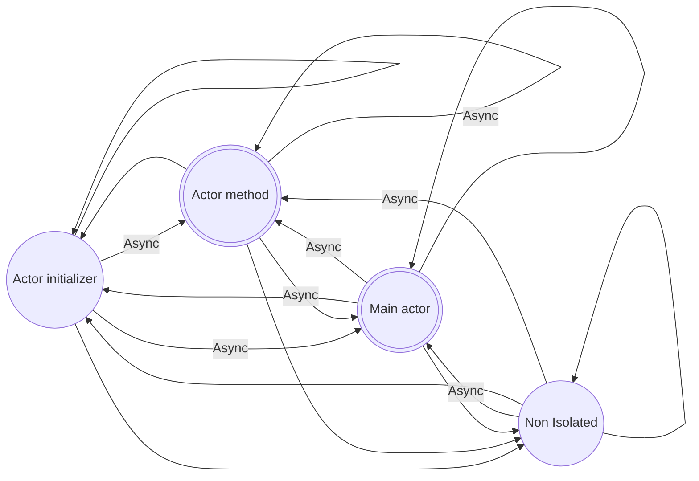

# Interactions between contexts

<!--And some <Highlight>custom markup</Highlight>...-->

These are the interactions between the swift contexts.

| Caller / Callee  | Main Actor                     | Actor                                                                                        | Non Isolated                   |
| ---------------- | ------------------------------ | -------------------------------------------------------------------------------------------- | ------------------------------ |
| **Main Actor**   | :white_check_mark: Call freely | :white_check_mark: Initializer: Call freely   ⏰️ Asynchronously for the rest of methods | :white_check_mark: Call freely |
| **Actor**        | ⏰️ Asynchronously             | :white_check_mark: Initializer: Call freely   ⏰️ Asynchronously for the rest of methods | :white_check_mark: Call freely |
| **Non Isolated** | ⏰️ Asynchronously             | :white_check_mark: Initializer: Call freely   ⏰️ Asynchronously for the rest of methods | :white_check_mark: Call freely |

 
 

 

:::tip[Async calling]
To use 'async', the caller should be on an asynchronous context (e.g. async method, initializer, variable)
:::
